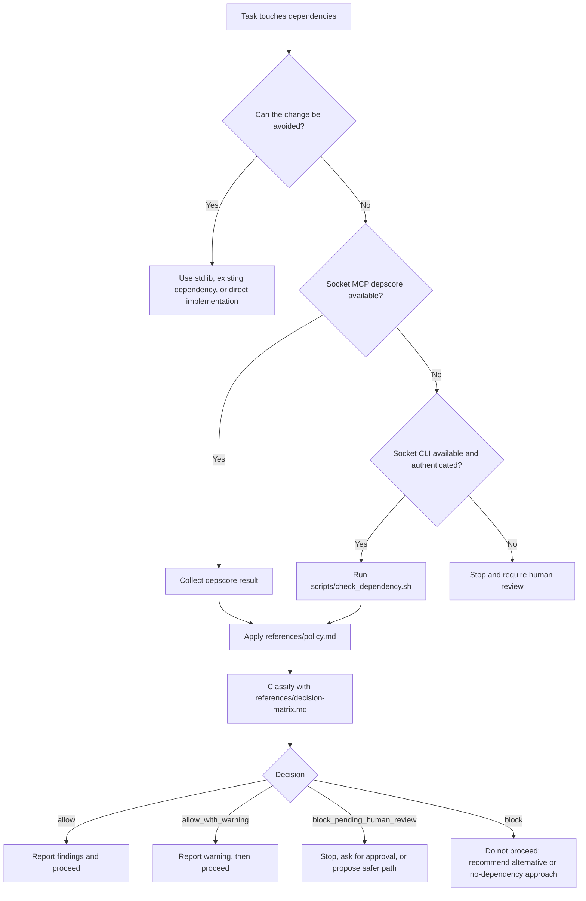

# Socket Dependency Guard

Portable dependency-review guardrail for agentic coding workflows.

This repository now packages the same policy in multiple forms:

- `SKILL.md`: native Codex skill entrypoint
- `SKILL.md` with OpenClaw metadata: OpenClaw workspace/global skill entrypoint
- `agents/openai.yaml`: Codex UI metadata
- `AGENTS.md`: project instructions for agents that auto-load `AGENTS.md`
- `CLAUDE.md`: Claude Code project memory
- `references/`: canonical policy, decision matrix, and reporting examples
- `scripts/check_dependency.sh`: helper that generates a Socket CLI review artifact
- `examples/github/socket-dependency-guard.yml`: copyable GitHub Actions example using `socket ci`

## Supported Agent Shapes

- Codex app: native skill via `SKILL.md`
- OpenClaw: native skill via `SKILL.md` in a `skills/` directory
- Codex CLI: project instructions via `AGENTS.md`
- Claude Code: project memory via `CLAUDE.md`
- Other `AGENTS.md`-aware agents: use `AGENTS.md`

## Installation

Use the installer to vendor this bundle into a project or install it globally for a supported agent:

```sh
./scripts/install_skill.sh --mode project --agent all
./scripts/install_skill.sh --mode global --agent codex
./scripts/install_skill.sh --mode global --agent claude
./scripts/install_skill.sh --mode global --agent antigravity
./scripts/install_skill.sh --mode global --agent openclaw
```

Project mode:

- copies the bundle into `.agent-skills/socket-dependency-guard` for Codex, Claude, and Antigravity
- copies the bundle into `skills/socket-dependency-guard` for OpenClaw
- updates project-root `AGENTS.md` for Codex-style and Antigravity-style project instructions
- updates project-root `CLAUDE.md` with an import for Claude Code

Global mode:

- Codex: installs into `$CODEX_HOME/skills/socket-dependency-guard` or `~/.codex/skills/socket-dependency-guard`
- Claude Code: installs into `~/.claude/skills/socket-dependency-guard` and updates `~/.claude/CLAUDE.md`
- Antigravity: installs into `~/.gemini/skills/socket-dependency-guard` and updates `~/.gemini/GEMINI.md`
- OpenClaw: installs into `~/.openclaw/skills/socket-dependency-guard`

## How It Works

This bundle is designed so an agent can apply the same dependency-review policy regardless of whether it is running as a native skill, an `AGENTS.md`-driven project instruction, or a Claude memory import.



Use the skill when a task adds, upgrades, replaces, or risk-reviews a dependency, including transient package execution such as `npx` or `pnpm dlx`.

Before changing manifests or lockfiles, the agent must report:

- why the package is needed
- whether an alternative already exists
- what Socket reported
- whether install scripts, risky capabilities, or transitive risk are present

### Why There Are Multiple Files

- `SKILL.md` is the native skill entrypoint for Codex and OpenClaw.
- `AGENTS.md` is for tools that auto-load project instructions from that filename.
- `CLAUDE.md` is the Claude Code memory adapter.
- `references/` holds the canonical policy so the adapters stay short and consistent.
- `scripts/check_dependency.sh` gives non-MCP environments a repeatable fallback path.

### OpenClaw Notes

- OpenClaw loads workspace skills from `<workspace>/skills`.
- This repo keeps OpenClaw metadata in `SKILL.md` only; it does not require a separate memory import file.
- The skill does not declare a required `socket` binary for OpenClaw because MCP `depscore` is the preferred path and should not be blocked by missing CLI tooling.

### Install Models

- Project install: use when you want one repository to enforce this guardrail without changing the user’s global agent configuration.
- Global install: use when you want the same dependency policy available across many repositories for one agent.

## Local Setup

Install the Socket CLI:

```sh
npm install -g socket
```

Optional wrapper protection:

```sh
socket wrapper on
```

Protected package-manager examples:

```sh
socket npm install <package>
socket npm uninstall <package>
socket npx <tool>
sfw npm ci
```

## Manual Review Helper

Generate a review artifact before changing dependencies:

```sh
./scripts/check_dependency.sh npm zod
```

The helper writes a markdown report under `tmp/socket-reports/` by default. Apply `references/decision-matrix.md` to that report before changing manifests or lockfiles.

## CI Enforcement Example

This repo includes a disabled-by-default example workflow at `examples/github/socket-dependency-guard.yml`.

To use it in another repository, copy it into `.github/workflows/socket-dependency-guard.yml`.

The example workflow:

- runs on pushes and pull requests
- installs the Socket CLI
- runs `socket ci`
- fails when the scan violates policy

Required secret:

- `SOCKET_SECURITY_API_KEY`

## References

- [Safe npm FAQ](https://docs.socket.dev/docs/safe-npm-faq)
- [Socket Firewall Overview](https://docs.socket.dev/docs/socket-firewall-overview)
- [Guide to Socket MCP](https://docs.socket.dev/docs/guide-to-socket-mcp)
- [Socket for GitHub Actions](https://docs.socket.dev/docs/socket-for-github-actions)
- [Guide to Socket CLI](https://docs.socket.dev/docs/socket-cli)
- [socket package](https://docs.socket.dev/docs/socket-package)
