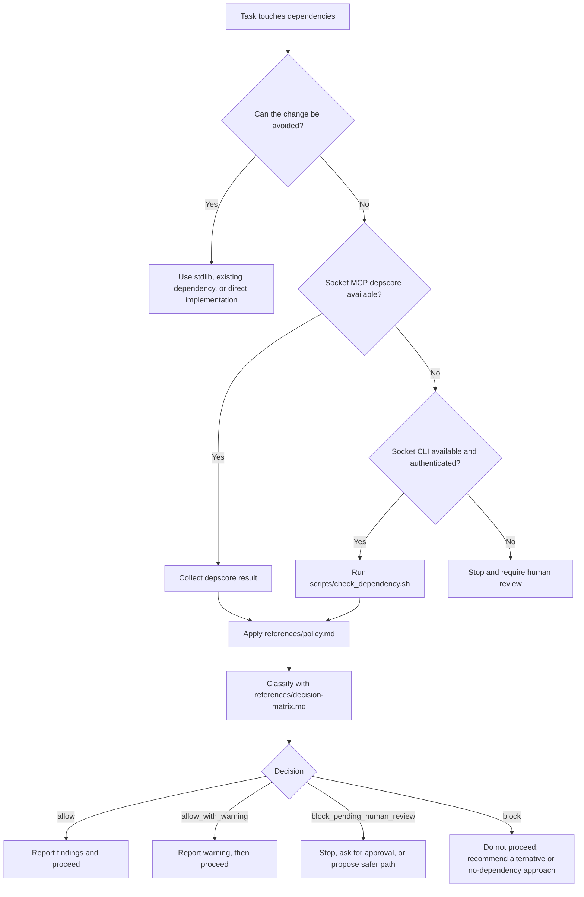

# IX Dependency Guard

Portable dependency-review guardrail for agentic coding workflows.

This repository now packages the same policy in multiple forms:

- `SKILL.md`: native Codex skill entrypoint
- `SKILL.md` with OpenClaw metadata: OpenClaw workspace/global skill entrypoint
- `agents/openai.yaml`: Codex UI metadata
- `AGENTS.md`: project instructions for agents that auto-load `AGENTS.md`
- `CLAUDE.md`: Claude Code project memory
- `references/`: canonical policy, decision matrix, and reporting examples
- `scripts/check_dependency.sh`: helper that generates a Socket CLI review artifact
- `examples/github/socket-dependency-guard.yml`: copyable GitHub Actions example using `socket ci`

## Supported Agent Shapes

- Codex app: native skill via `SKILL.md`
- OpenClaw: native skill via `SKILL.md` in a `skills/` directory
- Codex CLI: project instructions via `AGENTS.md`
- Claude Code: project memory via `CLAUDE.md`
- Other `AGENTS.md`-aware agents: use `AGENTS.md`

## Installation

Use the installer to vendor this bundle into a project or install it globally for a supported agent:

```sh
./scripts/install_skill.sh --mode project --agent all
./scripts/install_skill.sh --mode global --agent codex
./scripts/install_skill.sh --mode global --agent claude
./scripts/install_skill.sh --mode global --agent antigravity
./scripts/install_skill.sh --mode global --agent openclaw
```

Pass `--dry-run` to preview what would be written before committing:

```sh
./scripts/install_skill.sh --mode project --agent all --dry-run
```

To remove a previously installed bundle and its managed instruction blocks:

```sh
./scripts/install_skill.sh --mode project --agent all --uninstall
./scripts/install_skill.sh --mode global --agent claude --uninstall
```

Project mode:

- copies the bundle into `.agent-skills/socket-dependency-guard` for Codex, Claude, and Antigravity
  - Note: `--agent claude` uses the same `.agent-skills/` path as other non-OpenClaw agents
- copies the bundle into `skills/socket-dependency-guard` for OpenClaw
- updates project-root `AGENTS.md` for Codex-style and Antigravity-style project instructions
- updates project-root `CLAUDE.md` with an import for Claude Code

Global mode:

- Codex: installs into `$CODEX_HOME/skills/socket-dependency-guard` or `~/.codex/skills/socket-dependency-guard`
- Claude Code: installs into `~/.claude/skills/socket-dependency-guard` and updates `~/.claude/CLAUDE.md`
- Antigravity: installs into `~/.gemini/skills/socket-dependency-guard` and updates `~/.gemini/GEMINI.md`
- OpenClaw: installs into `~/.openclaw/skills/socket-dependency-guard`

## How It Works

This bundle is designed so an agent can apply the same dependency-review policy regardless of whether it is running as a native skill, an `AGENTS.md`-driven project instruction, or a Claude memory import.



Use the skill when a task adds, upgrades, replaces, or risk-reviews a dependency, including transient package execution such as `npx` or `pnpm dlx`.

Before changing manifests or lockfiles, the agent must report:

- why the package is needed
- whether an alternative already exists
- what Socket reported
- whether install scripts, risky capabilities, or transitive risk are present

### Why There Are Multiple Files

- `SKILL.md` is the native skill entrypoint for Codex and OpenClaw.
- `AGENTS.md` is for tools that auto-load project instructions from that filename.
- `CLAUDE.md` is the Claude Code memory adapter.
- `references/` holds the canonical policy so the adapters stay short and consistent.
- `scripts/check_dependency.sh` gives non-MCP environments a repeatable fallback path.

### OpenClaw Notes

- OpenClaw loads workspace skills from `<workspace>/skills`.
- This repo keeps OpenClaw metadata in `SKILL.md` only; it does not require a separate memory import file.
- The skill does not declare a required `socket` binary for OpenClaw because MCP `depscore` is the preferred path and should not be blocked by missing CLI tooling.

### Install Models

- Project install: use when you want one repository to enforce this guardrail without changing the user’s global agent configuration.
- Global install: use when you want the same dependency policy available across many repositories for one agent.

## Local Setup

Install the Socket CLI (npm package, used for local review commands):

```sh
npm install -g socket
```

> **Note on tooling:** There are three distinct Socket tools used by this bundle.
> - `socket` (npm) — local CLI review via `socket package shallow|deep`. Used pre-change.
> - `socketsecurity` (Python) — CI wrapper invoked by `socket ci` in the GitHub Actions example.
> - `sfw` (npm) — Socket Firewall, an install-time proxy that blocks fetches of confirmed-malicious packages. Optional but recommended; see below.
>
> They serve different purposes and complement each other. Review tools answer "should we add this?" before the manifest changes; Firewall is a safety net that catches anything reaching `install` time, including transitive pulls and manual edits.

Credential options for the CLI fallback:

```sh
socket login
```

Recommended interactive setup:

1. Run `socket login`.
2. If your CLI offers a blank-token path, press Enter at the token prompt to use the limited public token.
3. Decline system-wide enforcement when prompted.
4. Decline bash completion when prompted.
5. If you already have a private Socket API token, paste that instead of using the limited public token.

Environment-variable alternative for private credentials:

```sh
export SOCKET_SECURITY_API_TOKEN="your-private-token"
```

Notes:

- Prefer MCP `depscore` when available; Socket's hosted MCP path can work without local CLI credentials.
- The blank-submit `socket login` flow is a CLI behavior that may provide limited public access, but Socket's public docs do not currently publish a quota number for that mode.
- The official Socket API rate limit documented for authenticated API usage is `600 requests per minute`.
- Authenticated tokens can query remaining quota with `GET /v0/quota`; the endpoint itself consumes `0` quota units.
- Do not enable `socket wrapper on` or shell completion by default in this bundle. Keep the CLI fallback opt-in and local to the user.

CLI review examples:

```sh
socket package shallow npm zod
socket package deep npm zod --markdown
```

## Optional: Socket Firewall (install-time enforcement)

Socket Firewall (`sfw`) is a per-invocation proxy that intercepts package-manager fetches and blocks confirmed-malicious packages, including transitive dependencies. It complements the review-time guardrail in this bundle — review tooling decides whether to add a package; Firewall is a safety net at `install` time.

Install (free tier, no API key, no configuration):

```sh
npm install -g sfw
```

Use by prefixing your package-manager command:

```sh
sfw npm install
sfw pnpm install --frozen-lockfile
sfw yarn install --immutable
sfw pip install -r requirements.txt
sfw uv sync
sfw cargo fetch
```

Notes and caveats:

- Free tier supports npm, yarn, pnpm, pip, uv, and cargo against public registries only.
- Free tier blocks only confirmed malware; AI-flagged threats warn but do not block. The review-time layer in this bundle is still required.
- Free tier sends anonymous telemetry (machine identifier, blocked/permitted package metadata, latency, errors, and GitHub org name when present). It does not transmit source code or repo names.
- License is PolyForm Shield 1.0 (source-available, non-compete). Fine for internal use; not for redistribution.
- Enterprise tier adds private registries, more ecosystems (Go, Maven, Gradle, gem, Bundler, NuGet), and allow-listing — and requires `SOCKET_SECURITY_API_KEY`.
- Do not enable `socket wrapper on` system-wide; keep Firewall opt-in and per-command.

## Manual Review Helper

Generate a review artifact before changing dependencies:

```sh
./scripts/check_dependency.sh npm zod
```

The helper writes a markdown report under `tmp/socket-reports/` by default. Apply `references/decision-matrix.md` to that report before changing manifests or lockfiles.

## CI Enforcement Example

This repo includes a disabled-by-default example workflow at `examples/github/socket-dependency-guard.yml`.

To use it in another repository, copy it into `.github/workflows/socket-dependency-guard.yml`.

The example workflow:

- runs on pushes and pull requests
- installs the Socket Python CI wrapper (`socketsecurity`) and runs `socket ci` (review-time scan)
- installs Socket Firewall in `firewall-free` mode via `SocketDev/action@v1.3.1`
- includes a disabled `sfw npm ci` step you can re-enable and adapt for your ecosystem (the `if: false` guard prevents accidental runs in repos that do not need it)
- fails when the scan violates policy or when Firewall blocks a malicious fetch

Required secret:

- `SOCKET_SECURITY_API_KEY` for `socket ci` (review). Firewall-free mode does not require an API key. Use `firewall-enterprise` with `socket-token` if you need allow-lists, private registries, or extended ecosystem coverage.

## References

- [Safe npm FAQ](https://docs.socket.dev/docs/safe-npm-faq)
- [Socket Firewall Overview](https://docs.socket.dev/docs/socket-firewall-overview)
- [Guide to Socket MCP](https://docs.socket.dev/docs/guide-to-socket-mcp)
- [Socket for GitHub Actions](https://docs.socket.dev/docs/socket-for-github-actions)
- [Guide to Socket CLI](https://docs.socket.dev/docs/socket-cli)
- [socket package](https://docs.socket.dev/docs/socket-package)
